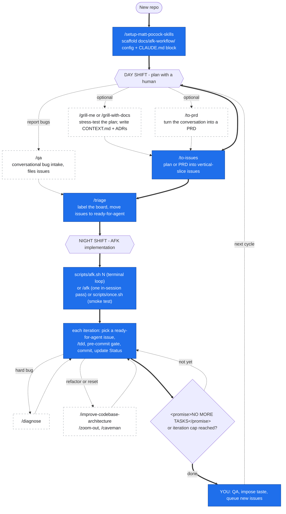

# afk-workflow

A portable Claude Code **marketplace plugin** that packages Matt Pocock's
"real engineer's" agentic workflow -- grill → PRD → vertical-slice issues →
triage → TDD -- plus a headless **Ralph** AFK (Away-From-Keyboard) loop, so you
can drop the whole pipeline into any repo with one install.

It bundles **13 skills**, two terminal runner scripts (`once.sh` / `afk.sh`),
an in-session `/afk` command, and a per-repo `setup` skill that teaches the
skills where your issues, triage labels, and domain docs live.

> Credit: the skills are derived from [`mattpocock/skills`](https://github.com/mattpocock/skills)
> and the runner scripts from `mattpocock/ai-hero-cli`, both MIT. This repo
> adapts them for cross-repo reuse with Windows-specific runner fixes and
> **vendors them into this plugin** -- there is nothing to install from those
> upstream repos.

---

## The workflow

Pocock splits the work into a human **day shift** (planning) and an autonomous
**night shift** (AFK implementation). Solid arrows are the **required** path;
dashed branches are **optional** helpers you reach for when you need them.



### Commands, in order

| # | Step | Command | Required? |
|---|---|---|---|
| 1 | Set up the repo (once) | `/setup-matt-pocock-skills` | **Required** |
| 2 | Stress-test the plan | `/grill-me` or `/grill-with-docs` | Optional |
| 3 | Write a PRD | `/to-prd` | Optional |
| 4 | Create the backlog | `/to-issues` | **Required** \* |
| - | (alt) File bugs conversationally | `/qa` | Optional |
| 5 | Label the board | `/triage` (to `ready-for-agent`) | **Required** |
| 6 | Run the night shift | `scripts/afk.sh N` (or `/afk`, or `scripts/once.sh`) | **Required** |
| - | ...during build: a hard bug | `/diagnose` | Optional |
| - | ...during build: messy code | `/improve-codebase-architecture`, `/zoom-out`, `/caveman` | Optional |
| 7 | Re-enter the loop | you: QA, queue new issues, repeat | -- |

\* You need *some* issues in `ready-for-agent` state before the loop does
anything. Get them there with `/to-issues` (from a plan/PRD), `/qa` (from bug
reports), or by hand-writing files under `docs/afk-workflow/backlog/<feature>/issues/`.
Step 6's loop runs `/tdd` on each issue automatically -- you don't invoke it directly.

## Install

This repo is a single-plugin marketplace. From any project (or globally):

```
/plugin marketplace add jspicher/afk-workflow
/plugin install afk-workflow@afk-workflow
```

Or point at a local clone during development:

```
/plugin marketplace add C:/path/to/afk-workflow
/plugin install afk-workflow@afk-workflow
```

**That single install is everything** -- all 13 skills (including the ones
derived from `mattpocock/skills`) are bundled inside this plugin, so they become
available immediately. You do **not** install `mattpocock/skills`, the
`ai-hero-cli`, or anything else separately.

The `once.sh` / `afk.sh` night-shift scripts live under the installed plugin's
`scripts/` dir and are run from a terminal, not as slash commands -- see
[Runner scripts (the night shift)](#runner-scripts-the-night-shift----cli-usage)
for how to locate and run them.

## First-time setup (per repo)

The engineering skills are **config-driven** -- they read `docs/afk-workflow/config/*.md`
in the consuming repo to learn your issue tracker, triage labels, and domain
doc layout. Run the setup skill once per repo before first use:

```
/setup-matt-pocock-skills
```

It walks you through three choices (issue tracker: GitHub / GitLab / local
markdown / other · triage label vocabulary · single- vs multi-context domain
docs) and scaffolds an `## Agent skills` block in `CLAUDE.md`/`AGENTS.md` plus
`docs/afk-workflow/config/{issue-tracker,triage-labels,domain}.md`.

## What it writes in a consuming repo

Everything the workflow creates or reads lives under a single, removable
`docs/afk-workflow/` directory -- plus one small pointer block in
`CLAUDE.md`/`AGENTS.md`:

```
docs/afk-workflow/
├── config/         # issue-tracker.md, triage-labels.md, domain.md  (from setup)
├── backlog/        # <feature>/PRD.md + <feature>/issues/NN-*.md     (to-prd, to-issues)
├── context/        # CONTEXT.md / CONTEXT-MAP.md   (domain glossary, grill-with-docs)
├── adr/            # 0001-*.md ...                 (architecture decision records)
└── out-of-scope/   # <concept>.md                 (rejected-feature records, triage)
```

To remove the workflow's footprint, delete `docs/afk-workflow/` and the
`## Agent skills` block from `CLAUDE.md`/`AGENTS.md`.

> **Multi-context monorepos:** per-context `CONTEXT.md` + ADRs stay co-located
> with their `src/<context>/` code; only `CONTEXT-MAP.md` and system-wide ADRs
> live under `docs/afk-workflow/`.

## Skills

| Skill | Stage | What it does |
|---|---|---|
| `grill-me` | Plan | Relentless one-question-at-a-time interview to reach shared understanding of a plan |
| `grill-with-docs` | Plan | Same, but for an existing codebase -- writes `CONTEXT.md` + ADRs as decisions land |
| `to-prd` | Plan | Synthesizes the conversation into a Product Requirements Document |
| `to-issues` | Plan | Breaks a PRD into independently-grabbable **vertical-slice** issues with DAG dependencies |
| `triage` | Plan | State-machine triage; applies the canonical label vocabulary to the whole board |
| `qa` | Plan | Interactive QA session -- user reports bugs conversationally; files durable, tracker-agnostic issues |
| `tdd` | Build | Strict red-green-refactor loop (+ deep-modules / interface / mocking / refactoring refs) |
| `diagnose` | Build | Disciplined bug/perf diagnosis loop: reproduce → minimise → hypothesise → instrument → fix → regression-test |
| `improve-codebase-architecture` | Build | Ousterhout "deep module" refactoring, interface design, domain language |
| `zoom-out` | Build | Step back from the weeds to re-evaluate approach |
| `caveman` | Build | Dumb-it-down / simplify pass |
| `write-a-skill` | Meta | Author a new skill |
| `setup-matt-pocock-skills` | Setup | Scaffold the per-repo `docs/afk-workflow/config/*` config the other skills read |

## Runner scripts (the night shift) -- CLI usage

The night shift runs from a **normal terminal** (Git Bash on Windows), not from
inside a Claude Code session. Both scripts must be run **from your project root**
so `docs/afk-workflow/` and git history resolve, and both re-exec themselves out
of WSL automatically (WSL's keyring breaks `gh` push auth).

| Script | Signature | Purpose |
|---|---|---|
| `once.sh` | `once.sh [issues_glob]` | Run **one** Ralph iteration. Smoke test before committing to the loop. |
| `afk.sh` | `afk.sh <max_iterations> [issues_glob]` | Run the loop until the stop sentinel fires or the iteration cap is hit. |

In both, `issues_glob` is optional and defaults to
`docs/afk-workflow/backlog/*/issues/*.md` (the local-markdown convention from
`/setup-matt-pocock-skills`). For a GitHub/GitLab tracker, edit the `issues=`
line in the script to use `gh issue list` / `glab issue list`.

### 1. Locate the scripts

The scripts are **not** on your `PATH`, and `${CLAUDE_PLUGIN_ROOT}` is only set
*inside* a Claude Code session -- from a plain terminal you invoke them by
absolute path. Three ways to get that path, easiest first:

**a. You installed from a local clone** -- just point at the clone's `scripts/`:

```bash
AFK="C:/wamp64/www/.claudebot/.projects/afk-workflow/scripts"   # your clone path
```

**b. You installed from GitHub** -- Claude Code clones the marketplace repo
under `~/.claude/plugins/marketplaces/`. The scripts typically land at
`~/.claude/plugins/marketplaces/afk-workflow/scripts/`; if that exact path isn't
there, locate it:

```bash
find "$HOME/.claude/plugins/marketplaces" -path '*afk-workflow*/scripts/afk.sh' 2>/dev/null
AFK="$HOME/.claude/plugins/marketplaces/afk-workflow/scripts"   # adjust to match
ls "$AFK"        # once.sh  afk.sh  prompt.md
```

**c. Copy them into your project** (most ergonomic for repeated runs) -- vendor
the three files and call them with a short relative path:

```bash
mkdir -p scripts/afk
cp "$AFK"/{once.sh,afk.sh,prompt.md} scripts/afk/
bash scripts/afk/afk.sh 20
```

The examples below use `$AFK` for the resolved `scripts/` dir.

### 2. `once.sh` -- a single iteration (smoke test)

```bash
# default: every issue under docs/afk-workflow/backlog/*/issues/*.md
bash "$AFK/once.sh"

# scope to one feature's backlog:
bash "$AFK/once.sh" "docs/afk-workflow/backlog/checkout-redesign/issues/*.md"
```

It concatenates your open issues + the last 5 commits + `prompt.md`, pipes them
into `claude --dangerously-skip-permissions`, and the agent picks one
`ready-for-agent` issue, implements it with `/tdd`, runs your pre-commit gate,
commits, and updates that issue's `Status:`. Then it exits. No `jq` required --
this is the lightest way to confirm the plumbing works before you let the loop
run unattended.

### 3. `afk.sh` -- the loop

`max_iterations` is **required** -- a hard cap so a runaway agent can't loop
forever. The optional second arg is the issues glob (same default as `once.sh`).

```bash
# up to 20 iterations over the default backlog glob
bash "$AFK/afk.sh" 20

# 50 iterations, scoped to one feature
bash "$AFK/afk.sh" 50 "docs/afk-workflow/backlog/checkout-redesign/issues/*.md"

# a single pass, but with the loop's stream-json output + sentinel check
bash "$AFK/afk.sh" 1
```

Each iteration runs the same pick → `/tdd` → gate → commit → update-`Status:`
cycle as `once.sh`, but streams the agent's output as `stream-json` and inspects
the final result. The loop **stops early** the moment the agent emits
`<promise>NO MORE TASKS</promise>` (i.e. zero issues left in `ready-for-agent`);
otherwise it runs until `max_iterations`. Requires `jq` + `mktemp` (Git Bash
ships both).

> ⚠️ Both scripts run with `--dangerously-skip-permissions` -- the agent edits
> files, runs your gate, and commits with **no approval prompts**. **Run on a
> dedicated branch or a git worktree and keep `main`/`master` protected.**
> Pocock's original sandboxes each agent in Docker (his "Sand Castle" lib); this
> lighter setup trades that for branch isolation.

### 4. End-to-end CLI example

```bash
# from your project root, on a throwaway branch
git switch -c afk/checkout-redesign

AFK="$HOME/.claude/plugins/marketplaces/afk-workflow/scripts"
GLOB="docs/afk-workflow/backlog/checkout-redesign/issues/*.md"

# 1. smoke-test a single issue
bash "$AFK/once.sh" "$GLOB"

# 2. happy with it? let it run the backlog down, up to 30 passes
bash "$AFK/afk.sh" 30 "$GLOB"

# 3. review the commits the agent made
git log --oneline master..HEAD
```

**In-session alternative:** if you're already in a Claude Code session and want
to watch the agent work one task interactively, use the bundled `/afk` command
instead of these terminal scripts.

## Prerequisites

- **Claude Code CLI** on `PATH` (`claude`)
- **Git Bash** (Windows) -- ships `jq`, `mktemp`, `grep`
- A **test + type + build feedback loop** in the target repo (the agent codes
  blind without one)
- Issues created via `/to-issues` and labelled via `/triage` before launching
  the loop

## Layout

```
afk-workflow/
├── .claude-plugin/
│   ├── marketplace.json     # single-plugin marketplace manifest
│   └── plugin.json          # plugin manifest
├── skills/                  # 13 skills (verbatim Pocock + helpers)
├── commands/
│   └── afk.md               # /afk -- one in-session iteration
├── scripts/
│   ├── once.sh              # single headless iteration
│   ├── afk.sh               # the headless loop
│   └── prompt.md            # the Ralph task-selection prompt
└── docs/
    └── triage-labels.md     # canonical status vocabulary reference
```

## License

MIT. See [LICENSE](./LICENSE) and the attribution note within it.
