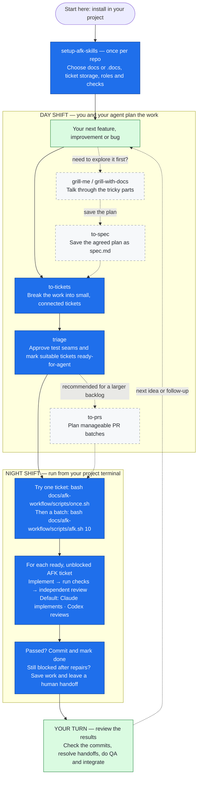

# AFK Workflow

Plan with a human, implement with an agent, and review before committing.
AFK Workflow packages Matt Pocock's engineering skills with a portable Bash runner
for Claude Code and Codex CLI.

**v0.6.0 defaults:** local Markdown tickets, assets under `./docs/afk-workflow/`,
Claude as implementer, Codex as reviewer, and two repair attempts per ticket.
Both roles are configurable; Claude-only and Codex-only runs are supported.

The plugin includes 18 skills. Claude uses a marketplace plugin; Codex uses
versioned per-project copies. The headless runner uses Bash, Git, `jq`, and ordinary
shell utilities. No Python or Node runtime is introduced.

Skills derive from [mattpocock/skills](https://github.com/mattpocock/skills), with the
runner originally derived from [ai-hero-cli](https://github.com/mattpocock/ai-hero-cli).
Both are MIT licensed. [Upgrade decisions and provenance](docs/v0.6.0-upgrade.md)
explain the deliberate differences.

## The workflow

Think of this as a **day shift** with you at the keyboard, followed by a **night
shift** where the agents work through the tickets you approved. Start with one
ticket so you can watch the whole cycle before launching a batch.

Solid arrows show the usual route; dashed arrows are optional planning helpers.
The chart uses short skill names; the table below gives the exact commands for
Claude and Codex.



### Commands, in order

Type the skill commands **inside your Claude or Codex session**, after
[installation](#install). Pick the column for the CLI you're using:

| Step | When to use it | Claude Code | Codex CLI |
| --- | --- | --- | --- |
| 1. Set up the project | Once per repo; rerun to change your settings | `/afk-workflow:setup-afk-skills` | `$setup-afk-skills` |
| 2. Talk through the idea | Optional; useful when the scope is still fuzzy | `/afk-workflow:grill-me` or `/afk-workflow:grill-with-docs` | `$grill-me` or `$grill-with-docs` |
| 3. Save the plan | Optional; capture the conversation in a specification | `/afk-workflow:to-spec` | `$to-spec` |
| 4. Create tickets | When you need to turn a plan into a backlog | `/afk-workflow:to-tickets` | `$to-tickets` |
| 5. Make tickets ready | **Required**; check scope, blockers, AFK/HITL type and test approval | `/afk-workflow:triage` | `$triage` |
| 6. Plan PR batches | Recommended when several tickets need grouping | `/afk-workflow:to-prs` | `$to-prs` |

Already have a clear ticket? Go straight to triage. Reporting a bug? Use
`/afk-workflow:qa` in Claude or `$qa` in Codex, then triage the resulting ticket.
New tickets start `needs-triage`; only approved, unblocked `ready-for-agent`
tickets with an AFK type can run unattended. `to-prs` writes a plan and suggested
batch commands; you decide when to create the actual PRs.

**Same session or fresh?** Keep the planning conversation open for `to-spec` and
`to-tickets`. Once the plan is saved, you can start fresh: triage and batch planning
read the saved tickets. The runner starts a fresh implementer session for each
ticket and a fresh reviewer for each review; repairs resume that ticket's
implementer session.

### 7. Try one ticket, then run a batch

Open a **terminal at your project root** (Git Bash on Windows), on a dedicated
branch or worktree with a clean starting state. These commands work with either
CLI; `workflow.json` determines who implements and who reviews.

```bash
# Start with one ticket: implement, check, review, then commit if it passes
bash docs/afk-workflow/scripts/once.sh

# Happy with the result? Attempt up to 10 tickets
bash docs/afk-workflow/scripts/afk.sh 10

# Or swap the roles for this run: Codex implements, Claude reviews
bash docs/afk-workflow/scripts/afk.sh 10 --implementer codex --reviewer claude
```

Chose `.docs` during setup? Use that path instead:

```bash
bash .docs/afk-workflow/scripts/once.sh
bash .docs/afk-workflow/scripts/afk.sh 10
```

From an open agent session, `/afk-workflow:afk` in Claude or `$afk` in Codex also
launches one configured ticket lifecycle. For hands-on implementation in your
current session, use `/afk-workflow:implement` or `$implement` with the ticket.

Checks and review happen automatically. The default repair allowance is two
attempts after the initial implementation. If a ticket still needs human help,
the runner saves its work, records the handoff and continues with independent
tickets. The run stops when no runnable work remains or it reaches your ticket
limit. See [Commands](#commands) for selection options and exit codes.

### 8. Come back, review and integrate

Read the run summary and ticket progress notes, inspect the commits, resolve
`needs-info` / `ready-for-human` handoffs, and do your project's human QA. Then
open and merge PRs through your normal process. The runner commits locally; it
does not push, open PRs, merge or deploy. Feed any follow-up work back into triage
for the next run.

## Install

### Claude Code

In Claude Code:

```text
/plugin marketplace add jspicher/afk-workflow
/plugin install afk-workflow@afk-workflow
/afk-workflow:setup-afk-skills
```

Plugin skills use qualified names such as `/afk-workflow:to-tickets` and
`/afk-workflow:code-review`. This avoids accidentally invoking a personal or built-in
skill with the same name. During development load the isolated checkout using
`claude --plugin-dir /path/to/afk-workflow`.
For headless development runs, set `AFK_CLAUDE_PLUGIN_DIR` to that checkout so the
spawned Claude sessions load the same plugin version. Normal runs use the installed
Claude plugin; update it along with the project Codex copies and runtime.

### Codex CLI: project skill copies

Obtain an AFK Workflow source checkout at the desired version. From the target
project, preview the installation, then apply it:

```bash
bash /path/to/afk-workflow/scripts/install-codex.sh .
bash /path/to/afk-workflow/scripts/install-codex.sh . --apply
```

Start a new Codex session in that project and invoke:

```text
$setup-afk-skills
```

The installer copies skills into `.agents/skills/`, including the setup assets
needed without Claude installed. `.agents/afk-workflow-installed.json` records
the version and managed file hashes. An additional runtime manifest records setup's
bundled runners. Both are installation metadata, not credentials.

Run the same installer from an updated source checkout to update copies. It
preflights the whole copy set and refuses modified files or conflicting unrelated
skills. Review and reconcile conflicts first. Extra unmanaged files are preserved.
Copies are intentionally pinned; updating the source checkout does not update
every project automatically.

Codex discovers `.agents/skills/` separately from the selected asset directory.
The default reviewer is Codex, so a default headless run needs these project copies
even when setup was invoked from Claude. Configure both roles as Claude if Codex
is not being used. [Codex skill locations](https://learn.chatgpt.com/docs/build-skills)

## Setup and storage

The setup skill explores the project, then asks one question at a time:

1. **Asset parent directory:** `./docs` for new projects; existing choices are retained.
2. **Ticket storage:** local Markdown by default, or GitHub, GitLab, Jira, another workflow.
3. **Roles:** Claude implements and Codex reviews by default; models are optional.
4. The actual project checks, applicable label mappings, and domain-document layout.

The asset location and ticket method are independent. GitHub tickets still need
local configuration and runners. A GitHub remote never silently changes the local
storage default.

| Storage | Interactive skills | Built-in headless runner |
| --- | --- | --- |
| Local Markdown | Yes | Yes |
| GitHub Issues | Yes, through `gh` | Yes, through `gh` |
| GitLab | Recorded project workflow | Not in v0.6.0 |
| Jira | Recorded project workflow/integration | Not in v0.6.0 |
| Other | User-described integration | Not in v0.6.0 |

Interactive support for Jira or another service means following the recorded
integration; setup does not install or authenticate an unspecified connector.
Unsupported headless stores fail explicitly rather than reading a local backlog.

Choosing `./.docs` creates this layout:

```text
.docs/afk-workflow/
├── config/
│   ├── workflow.json          # canonical roles, storage, labels and checks
│   ├── issue-tracker.md       # project-specific ticket conventions
│   ├── triage-labels.md       # human-readable role guidance
│   ├── domain.md              # domain document locations and reading rules
│   └── installed-runtime.json
├── scripts/                   # entrypoints, shared helpers, schemas and prompts
├── backlog/<feature>/
│   ├── spec.md
│   ├── PR-PLAN.md
│   └── issues/<NN>-<slug>.md
├── context/                   # CONTEXT.md or CONTEXT-MAP.md
├── adr/
└── out-of-scope/
```

Context/ADR/backlog directories are created when needed. Small managed blocks in
`AGENTS.md` and `CLAUDE.md` point at the selected root. If Claude already forwards
to `AGENTS.md`, setup preserves that arrangement. Reruns update managed blocks
without replacing surrounding instructions or custom tracker/domain notes.

Setup reports ignore behavior. It never force-adds assets or changes ignore rules.
An intentionally ignored `.docs/` backlog remains local-only and is absent from CI
and other checkouts. Copy it deliberately when preparing a worktree that needs it.

## Configuration

Edit the selected root's `config/workflow.json`. Example for a project with an
existing `npm run check` command:

```json
{
  "schemaVersion": 1,
  "assetsDir": "./docs",
  "tracker": { "type": "local", "format": "markdown" },
  "roles": {
    "implementer": { "cli": "claude" },
    "reviewer": { "cli": "codex" }
  },
  "review": { "maxRepairAttempts": 2 },
  "checks": [["npm", "run", "check"]]
}
```

Use the project's actual complete gate. Each check is an argument array executed
directly; the runner does not `eval` configuration. For an environment requirement,
use an explicit command such as `["env","TURBO_FORCE=true","pnpm","test"]`.
A check may intentionally invoke a shell with its own command string, but that
must be an explicitly reviewed project command.

`roles.<role>.cli` accepts `claude` or `codex`. Optional `model` strings are passed
to that role's CLI; omitted models inherit its configuration. To reverse roles:

```json
"roles": {
  "implementer": { "cli": "codex" },
  "reviewer": { "cli": "claude" }
}
```

For GitHub, set `tracker.type` to `github` and `tracker.repository` to `owner/repo`.
Optional `tracker.labels` maps canonical states to actual labels, for example
`{"ready-for-agent":"agent:ready","needs-info":"waiting:requirements"}`.
Unspecified labels use their canonical names. Closed-as-completed issues satisfy
blockers; closed-as-not-planned issues do not. The adapter includes pagination,
comments and native issue dependencies, then verifies tracker mutations.
Native blockers from another repository retain their identity and block this
runner until resolved in the configured ticket graph; matching issue numbers in
different repositories never count as the same ticket.

Use `tracker.format: "fos-yaml"` for existing FoS-style YAML tickets. The adapter
supports simple scalar status/type/id and inline or block `depends_on` lists.
It is not a general YAML parser: malformed or unsupported metadata is an error,
never an empty queue. Preserve project-specific fields and body content.

## Commands

Run headless commands from the target repository. Replace `docs` with the selected
asset parent in these examples:

```bash
# Up to ten ticket attempts, using configured roles
bash docs/afk-workflow/scripts/afk.sh 10

# One ticket lifecycle, including review and repair
bash docs/afk-workflow/scripts/once.sh

# Per-run role overrides; project config is unchanged
bash docs/afk-workflow/scripts/afk.sh 10 --implementer codex --reviewer claude
bash docs/afk-workflow/scripts/once.sh --implementer claude --reviewer claude

# Restrict local selection; quote the glob so the runner expands it
bash docs/afk-workflow/scripts/afk.sh 5 'docs/afk-workflow/backlog/search/issues/*.md'

# Use a supplied config explicitly
bash docs/afk-workflow/scripts/afk.sh 5 --config docs/afk-workflow/config/workflow.json

# Independent review for interactive implementation
bash docs/afk-workflow/scripts/review.sh BASE_COMMIT docs/afk-workflow/backlog/search/spec.md
```

Role flags override configuration. If an override changes CLI, that CLI's own
default model is used; an engine-specific model from the replaced role is not
passed to the other provider. The two roles can use the same CLI but still run in
separate sessions. There is no automatic provider fallback.

`afk.sh N` counts ticket attempts, not individual model calls. A ticket can have
its initial implementation/review plus two repair attempts. `once.sh` attempts
exactly one ticket. A specific local ticket path is also a valid exact glob.

| Exit | Meaning |
| --- | --- |
| 0 | Completed requested single ticket, or no agent-ready work remains |
| 1 | Runtime/configuration/CLI/recovery error; inspect artifacts |
| 2 | Blocked work or tickets handed back to a human |
| 3 | Ticket-attempt limit reached with agent-ready work remaining |
| 130 | Interrupted run |

`<promise>NO MORE TASKS</promise>` is emitted by the controller only for its verified
completion outcome. It is not inferred from arbitrary model text or tool output.
Human-only backlog items can still exist; completion of the agent queue is not a
claim that all project work is finished.

## Ticket readiness and review

New Markdown tickets keep the existing body format:

```markdown
# 01: Search by title
Status: needs-triage
Type: AFK

## What to build
Allow searching titles through the existing search interface.

## Blocked by
None

## Acceptance criteria
- A title match is returned through the public search interface.
```

Local blockers use filename stems such as `01-search-index`, or
`other-feature/01-search-index` across features. Markdown links to those identifiers
are accepted. GitHub uses `#123` and native blocking links. Ambiguous titles and
missing references block execution. State values stay canonical in local files;
GitHub uses the configured label mapping. An explicit HITL type is never runnable.

During triage, record the human's actual test approval:

```markdown
## Approved test seams
Approval: approved
- Existing search interface: query a title and inspect the returned matches.
```

This is durable approval, not a new confirmation prompt on each headless iteration.
For a documentation-only change, an approved explanation that no new tests are
needed is valid. An unapproved or contradictory ticket is handed back as
`needs-info`. New tickets cannot bypass triage just because planning created them.

The implementer works at those seams. The controller runs the configured full
gate, then starts a fresh reviewer against the starting commit and all working
changes, including new files. Standards and Spec are reported separately. Concrete
violations block completion; advisory code smells do not. Missing review evidence,
invalid structured results, or an unavailable reviewer never count as a pass.

Implementers use the existing full-access/no-prompt execution posture. Reviewers
use read-only permissions. The runner checks that review did not change the source
and that the committed tree matches the reviewed tree. Project instructions and
AFK/HITL boundaries still apply.

## Recovery and post-loop work

Run artifacts live in the checkout's Git metadata, resolved through `git rev-parse
--git-path afk-workflow`. This works with registered worktrees and avoids dirtying
the project with logs. The runner prints the exact location. Preserve these local
artifacts deliberately if you remove the worktree.

After exhausted repairs the runner saves a binary-capable tracked patch, copies
new files, and verifies them before restoring ticket changes. It records a
`ready-for-human` handoff and continues independent work. A failed backup or restore
stops the run. Recover the tracked changes with `git apply` against the recorded
baseline and copy the saved `recovery/new/` files back after reviewing them.

The runner refuses unrelated dirty/untracked work and another run's checkout lock.
A stale lock records its PID: verify that the process is gone before removing the
lock directory. Interrupted implementation leaves a pending journal and stops a
restart rather than silently repeating the ticket. Inspect the patch, working
state and journal before manually resolving that interruption.

A successful implementation commit is journaled before its tracker update. A clean
restart can reconcile completion when the ticket still matches the saved decision.
Recovery recognizes the exact saved local completion write and the run's own
GitHub progress marker, including interruptions after a metadata amendment or
issue closure. Changed human decisions, other metadata edits or unrelated source
changes stop for reconciliation; the runner does not overwrite that state.
For tracked local tickets, bookkeeping is folded into the implementation commit;
ignored tickets remain local. Escalations may create a separate bookkeeping commit
when their ticket files are tracked.

After the loop, read `needs-info` and `ready-for-human` progress notes, inspect both
review axes and the commits, perform human QA, and integrate using the project's
normal PR process. The automated review does not replace required human visual,
security, release, or stakeholder gates.

## Upgrade and relocate existing projects

This release adopts **to-tickets**, **to-spec**, and **spec.md**. The old
`to-issues`/`to-prd` commands are not aliases. Update active commands and links;
preserve historical records. Setup guides the migration of active `PRD.md` or
`prd.md`, detects collisions, and retains backups.

Use the relocation helper to preview and move an existing AFK tree:

```bash
bash /path/to/afk-workflow/scripts/migrate.sh --from docs --to .docs
bash /path/to/afk-workflow/scripts/migrate.sh --from docs --to .docs --apply
```

It inventories literal references, backs up the AFK tree and affected files, moves
only the workflow tree, updates references/configuration and verifies the results.
It refuses existing destinations and symlink paths. Review the diff and ignore
behavior afterward. Other project documentation stays in its original location.

Already using `.docs/afk-workflow/`? Select it during setup; no move is needed.
Preserve existing YAML ticket formats, domain notes, and local-only rules. Never
point the generic installer at a customized old runtime and force replacement:
review the reported conflicts, preserve a copy, and reconcile first.

## Skills and invocation

Use `/afk-workflow:<name>` in Claude and `$<name>` in Codex:

| Skill | Purpose |
| --- | --- |
| setup-afk-skills | Configure location, storage, roles, checks and conventions |
| grill-me | Stress-test an idea one question at a time |
| grill-with-docs | Grill while recording domain context and ADRs |
| to-spec | Synthesize an approved specification |
| to-tickets | Create dependency-aware AFK/HITL slices |
| triage | Verify requests, record approvals, establish readiness |
| to-prs | Plan release batches and their board-gating commands |
| implement | Interactive implementation with the shared review contract |
| afk | Launch one configured ticket lifecycle |
| tdd | Behavioral tests at approved seams |
| code-review | Separate Standards and Spec reviews |
| codebase-design | Shared module/interface/seam vocabulary |
| diagnose | Reproduce and diagnose with redacted evidence |
| improve-codebase-architecture | Explore active areas and present opportunities |
| qa | Conversational bug intake into the configured tracker |
| zoom-out | Map modules and callers at a higher level |
| write-a-skill | Author focused reusable skills |
| caveman | Optional terse output style |

Planning that synthesizes the conversation can stay in the same session. Triage,
ticket execution and reviews work from durable artifacts. Each new ticket starts
fresh; repairs resume only its captured implementer session. Each review is fresh.

## Prerequisites and troubleshooting

- Git, Bash, `jq`, and standard utilities (`awk`, `sed`, `find`, `sort`, `cp`, `diff`,
  `mktemp`). Git Bash is the Windows shell; validate `jq` separately.
- Installed, authenticated CLIs for the selected roles. The runtime requires
  Claude's `--permission-prompts` and structured outputs, or Codex's `exec`, JSONL,
  output schema, and last-message output. Existing subscription/CLI auth is reused;
  the runner does not set up API keys or disable normal skill discovery.
- GitHub mode additionally requires an authenticated `gh` with issue access.
- A configured project gate and a branch/worktree with clean starting source.

On Windows, invoking the shell entrypoint through WSL re-executes Git Bash to retain
Windows CLI/Git authentication. Explicit PATH order wins; `~/.local/bin` is only a
fallback. Prompts travel via stdin to avoid the Windows argument-length limit.
Honcho is disabled only for headless Claude invocations, preserving the existing
workaround for its teardown hook.

If a CLI fails, inspect its role-specific event log and pending journal. If Codex
cannot find a skill, reinstall the project copies and start a new session. If the
config cannot be found or its location disagrees with `assetsDir`, run setup or
use `--config`; the runner does not silently recreate a default docs tree.

## Development and validation

```bash
bash tests/run.sh
bash tests/adapters.sh
bash tests/recovery.sh
bash tests/hooks.sh
shellcheck -x -P scripts scripts/*.sh tests/*.sh
```

The fixture suite uses stub CLIs and disposable Git repositories. It validates
role selection, commit gating, repairs, blockers, approval handoffs, failure
handling, preservation and relocation. Live CLI checks should use separate
disposable fixtures, not a real backlog or production tracker.

Opt-in live checks (up to ten minutes per pairing, using your signed-in CLIs):

```bash
bash tests/live-smoke.sh claude codex
bash tests/live-smoke.sh codex claude
```

See [LICENSE](LICENSE) for the MIT license and attribution.
